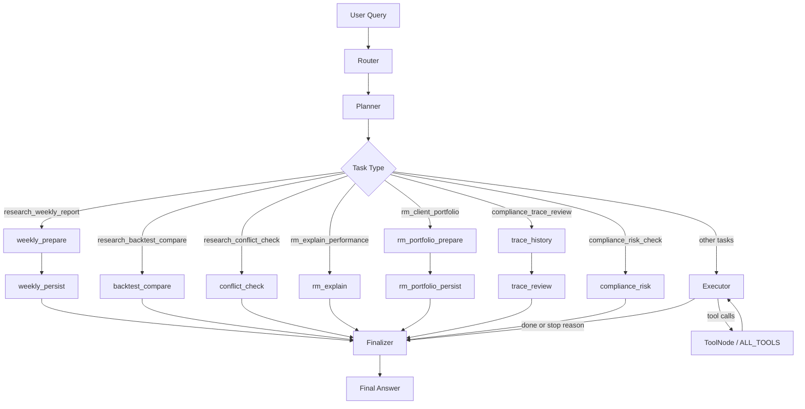

# AI Quant Assistant for ETF Rotation Strategies

一个面向 ETF / 行业轮动场景的 AI 量化研究助理项目，支持投研、投顾、合规三类角色，通过 LangGraph 编排自然语言任务，调用量化工具链完成研究、审查、报告生成与决策留痕。

当前版本已从“开放式 ReAct”演进为“结构化 `Router + Planner + Executor + Fixed Subgraphs`”的受控工作流，已完成 7 类高频任务节点化。当前代码职责已明确分层：`agent/graph.py` 负责主图编排，`agent/subgraph.py` 负责固定子图节点实现。

## 项目目标

这个项目的目标不是做一个纯聊天机器人，而是做一个可执行的 ETF 行业轮动工作流引擎：

- 根据用户自然语言请求识别任务类型
- 根据角色和任务选择合适的数据策略
- 调用行情、因子、四象限、ETF 映射、回测、新闻、Trace 等工具
- 输出适合投研、投顾、合规不同场景的结果
- 为正式建议保留 Decision Trace，支持审查与回溯

## 当前实现功能

### 已实现

- 三层 Prompt 体系：`base + role + task`
- 结构化 Router：根据 `role + user_input` 识别 `task_key`、`data_strategy`、`should_use_tools`、`requires_trace_save`
- Planner 计划生成：在执行前生成简要执行计划
- 受控 Executor：支持工具预算上限与重复调用检测，避免死循环
- 高频任务固定子图：已完成 7 类任务节点化，脱离通用 `executor`
- 通用工具链：行情、因子、四象限、观察池 / 负面清单、ETF 映射、回测、新闻、Trace、报告生成
- CLI 入口：支持交互式对话、单次查询、周报导出
- Trace 落盘与历史归档：生成 `trace_*.json`、`agent_response.txt` 与报告产物

### 当前未完成或仍在迭代

- `frontend/app.py` 仍是占位前端，尚未真正接入 `run_agent`
- 仍有中低频任务走通用 `executor`
- RM 的 `client_risk_level` 尚未在 CLI 入口中完整传入状态
- 多市场能力以 A 股最完整，港股 / 美股仍偏预留
- 合规 / 周报节点的字段 schema 仍可继续收敛统一

## 架构概览

### 工作流架构图



### 设计思路

1. `Router`
   - 使用结构化输出对用户任务进行分类
   - 产出 `task_key`、`data_strategy`、`should_use_tools`、`requires_trace_save` 等字段
   - 若结构化路由失败，回退到规则路由

2. `Planner`
   - 基于角色、市场、任务、数据策略生成文本计划
   - 不直接调用工具

3. `固定子图`
   - 对高频、稳定、可模板化的任务走固定节点链
   - 目前已节点化 7 类任务
   - 子图节点函数统一沉淀到 `agent/subgraph.py`

4. `Executor`
   - 用于承接尚未节点化的任务
   - 仍可调用工具，但受预算和重复调用保护

5. `Finalizer`
   - 不再调用工具
   - 汇总固定子图上下文或 Executor 上下文
   - 结合 `REFLECTION_PROMPT` 输出最终答案

## 目录结构

```text
AI_Quant_Assistant_for_ETF_Rotation_Strategies/
├── README.md
├── main.py                          # CLI 入口
├── requirements.txt                 # Python 依赖
├── .env.example                     # 环境变量示例
├── AGENT_ARCHITECTURE.md            # 架构设计说明
├── Competition_Business_Model_Value_Proposition.md
├── agent/
│   ├── graph.py                     # LangGraph 主图编排（Router/Planner/Executor/Finalizer）
│   ├── subgraph.py                  # 高频任务固定子图节点实现与分发逻辑
│   ├── state.py                     # AgentState
│   ├── router_schema.py             # 结构化路由 schema
│   ├── multi_agent.py               # 多智能体占位
│   └── prompts/
│       ├── base_prompt.py
│       ├── role_prompts.py
│       ├── task_prompts.py
│       ├── prompt_builder.py
│       ├── router_prompts.py
│       ├── workflow_prompts.py
│       ├── reflection_prompt.py
│       └── system_prompt.py         # 兼容旧用法的默认导出
├── tools/
│   ├── __init__.py                  # ALL_TOOLS 聚合
│   ├── data_tools.py
│   ├── factor_tools.py
│   ├── scoring_tools.py
│   ├── filter_tools.py
│   ├── mapping_tools.py
│   ├── backtest_tools.py
│   ├── news_tools.py
│   ├── trace_tools.py
│   └── report_tools.py
├── data/
│   └── providers/                   # akshare / tushare / yfinance 数据源
├── backtest/                        # 回测逻辑
├── config/                          # 市场、因子、阈值、ETF 映射、风控配置
├── templates/                       # 周报 / 话术 / 审批模板
├── scripts/                         # 报告导出脚本
├── frontend/
│   └── app.py                       # Streamlit 占位前端
├── traces/                          # Decision Trace 与生成产物
└── tests/manual/                    # 手工联通性脚本（数据源/流程）
```

### 核心文件说明

- `main.py`：统一 CLI 入口，支持交互模式、单次查询、周报导出
- `agent/graph.py`：主图组装文件，负责 Router、Planner、Executor、Finalizer 以及节点连线
- `agent/subgraph.py`：固定子图实现文件，集中维护当前已节点化的高频任务
- `agent/router_schema.py`：Router 的结构化输出定义
- `agent/prompts/`：Prompt 三层体系与工作流提示词
- `tools/`：底层量化工具链
- `scripts/generate_report_html.py`：从 trace 生成 HTML / DOCX / PDF 周报

## 角色与任务

### 支持角色

- `researcher`
- `rm`
- `compliance`

### 已定义任务类型

- `research_weekly_report`
- `research_overlay_adjustment`
- `research_backtest_compare`
- `research_conflict_check`
- `rm_client_portfolio`
- `rm_explain_performance`
- `rm_batch_talking_points`
- `rm_market_specific`
- `compliance_trace_review`
- `compliance_risk_check`
- `compliance_veto_audit`
- `compliance_drawdown_check`
- `generic`

其中，当前已完成节点化的任务为：

- `research_weekly_report`
- `research_backtest_compare`
- `research_conflict_check`
- `rm_explain_performance`
- `rm_client_portfolio`
- `compliance_trace_review`
- `compliance_risk_check`

## 快速使用

### 1. 环境要求

- Python 3.10+
- 建议使用虚拟环境

### 2. 安装依赖

```bash
python3 -m venv .venv
source .venv/bin/activate
pip install -r requirements.txt
```

### 3. 配置环境变量

```bash
cp .env.example .env
```

至少需要配置：

```env
OPENAI_API_KEY=your_api_key_here
OPENAI_BASE_URL=https://aihubmix.com/v1
OPENAI_MODEL=deepseek-v3.2
```

可选配置：

- `JINA_API_KEY`
- `ALPHAVANTAGE_API_KEY`
- `TUSHARE_TOKEN`
- `TUSHARE_API_URL`

### 4. 运行方式

交互式 CLI：

```bash
python main.py
```

指定角色和市场启动交互式 CLI：

```bash
python main.py --role researcher --market a_share
python main.py --role rm --market a_share
python main.py --role compliance --market a_share
```

单次查询：

```bash
python main.py --query "生成本周 A 股行业轮动周报"
```

指定模型：

```bash
python main.py --query "生成本周 A 股行业轮动周报" --role researcher --market a_share --model deepseek-v3.2
```

从最新 trace 生成周报：

```bash
python main.py --report
```

直接使用脚本指定 trace 并导出格式：

```bash
python scripts/generate_report_html.py
python scripts/generate_report_html.py traces/2026-03-24/trace_xxx.json --format html
python scripts/generate_report_html.py traces/2026-03-24/trace_xxx.json --format all
```

启动前端占位页：

```bash
streamlit run frontend/app.py
```

注意：当前前端仍是占位实现，并未真正接入后端 Agent。

## 主要实现方案

### Prompt 体系

项目已将 Prompt 拆成三层：

- `base`
- `role`
- `task`

并通过 `prompt_builder.py` 在运行时动态拼接。

### Router

Router 使用结构化输出，返回：

- `task_key`
- `data_strategy`
- `should_use_tools`
- `requires_trace_save`
- `confidence`
- `route_reason`

如果结构化路由失败，会回退到规则路由，保证系统不会因为分类异常直接中断。

## 常用功能

下面这些请求会优先走 `agent/subgraph.py` 中的固定子图，而不是通用 `executor`。这些任务当前已经“节点化”，触发后会走稳定、可控、可复用的固定流程。

### 1. 投研周报：`research_weekly_report`

功能说明：

- 获取市场数据
- 计算因子并进行四象限划分
- 读取观察池 / 负面清单
- 做 ETF 映射
- 生成周报上下文，并按需保存 trace

示例命令：

```bash
python main.py --role researcher --market a_share --query "生成本周 A 股行业轮动周报"
python main.py --role researcher --market a_share --query "请输出本周行业轮动周报"
```

### 2. 合规 Trace 审查：`compliance_trace_review`

功能说明：

- 获取最近 trace 历史
- 定位最新 trace
- 检查关键字段完整性
- 生成合规审查上下文

示例命令：

```bash
python main.py --role compliance --market a_share --query "检查本期 trace 是否满足审查要求"
python main.py --role compliance --market a_share --query "请审查最近一期 Decision Trace"
```

### 3. 回测对比：`research_backtest_compare`

功能说明：

- 统一回测区间
- 分别执行月频 / 周频回测
- 汇总对比结果并写入最终回答上下文

示例命令：

```bash
python main.py --role researcher --market a_share --query "对比周频和月频调仓的回测表现"
python main.py --role researcher --market a_share --query "请做一份参数回测对比"
```

### 4. 信号冲突检查：`research_conflict_check`

功能说明：

- 计算因子并划分四象限
- 提取黄金区重点行业
- 读取观察池 / 负面清单
- 对重点行业做新闻核验

示例命令：

```bash
python main.py --role researcher --market a_share --query "检查当前轮动信号和新闻是否冲突"
python main.py --role researcher --market a_share --query "帮我做一下信号冲突检查"
```

### 5. RM 业绩解释：`rm_explain_performance`

功能说明：

- 获取最近决策历史
- 从用户问题抽取关键词
- 补充相关新闻证据
- 生成面向 RM 的解释上下文

示例命令：

```bash
python main.py --role rm --market a_share --query "为什么上周推荐的方向下跌了，帮我整理对客户的解释"
python main.py --role rm --market a_share --query "请解释最近组合表现并给出沟通话术"
```

### 6. RM 客户组合建议：`rm_client_portfolio`

功能说明：

- 计算当前市场因子与四象限
- 选择候选行业并映射 ETF
- 结合客户风险等级生成组合上下文
- 按需保存 trace

说明：当前 CLI 还没有单独暴露 `client_risk_level` 参数，因此更适合先通过自然语言在 query 中说明客户风险等级。

示例命令：

```bash
python main.py --role rm --market a_share --query "给一个中风险客户生成 ETF 组合建议和沟通话术"
python main.py --role rm --market a_share --query "请为 R3 风险等级客户生成当前组合建议"
```

### 7. 合规风险检查：`compliance_risk_check`

功能说明：

- 读取最新 trace
- 提取风险检查与审批状态
- 检查关键字段缺失项
- 输出合规风险审查上下文

示例命令：

```bash
python main.py --role compliance --market a_share --query "检查当前组合是否违反集中度和流动性要求"
python main.py --role compliance --market a_share --query "请执行一次合规风险检查"
```

### 固定子图总览

当前已节点化任务共 7 类：

- `research_weekly_report`
- `research_backtest_compare`
- `research_conflict_check`
- `rm_explain_performance`
- `rm_client_portfolio`
- `compliance_trace_review`
- `compliance_risk_check`

### 推荐演示命令清单

下面这组命令适合在项目演示、课程汇报或交接说明时直接使用，覆盖投研、RM、合规三类角色的典型场景。

#### 投研演示

```bash
python main.py --role researcher --market a_share --query "生成本周 A 股行业轮动周报"
python main.py --role researcher --market a_share --query "对比周频和月频调仓的回测表现"
python main.py --role researcher --market a_share --query "检查当前轮动信号和新闻是否冲突"
python main.py --role researcher --market a_share --query "请总结本周市场风格变化，并给出行业轮动观察"
```

#### RM 演示

```bash
python main.py --role rm --market a_share --query "为什么上周推荐的方向下跌了，帮我整理对客户的解释"
python main.py --role rm --market a_share --query "请解释最近组合表现并给出沟通话术"
python main.py --role rm --market a_share --query "给一个中风险客户生成 ETF 组合建议和沟通话术"
python main.py --role rm --market a_share --query "请为 R3 风险等级客户生成当前组合建议"
```

#### 合规演示

```bash
python main.py --role compliance --market a_share --query "检查本期 trace 是否满足审查要求"
python main.py --role compliance --market a_share --query "请审查最近一期 Decision Trace"
python main.py --role compliance --market a_share --query "检查当前组合是否违反集中度和流动性要求"
python main.py --role compliance --market a_share --query "请执行一次合规风险检查"
```

#### 报告导出演示

```bash
python main.py --report
python scripts/generate_report_html.py --format html
python scripts/generate_report_html.py --format all
```

#### 一套推荐演示顺序

如果你要现场完整展示一次工作流，推荐顺序如下：

1. 先运行投研周报命令，展示固定子图如何产出研究结果。
2. 再运行 RM 组合或业绩解释命令，展示不同角色下的输出差异。
3. 接着运行合规 Trace 审查或风险检查命令，展示留痕与审查闭环。
4. 最后运行 `python main.py --report`，展示 trace 到报告产物的导出链路。

### Subgraph 重构说明

- 已完成 `subgraph` 分层，将“高频任务子图”与“主图编排”职责分离
- `agent/graph.py`：主图构建、节点连线、执行控制（路由 / 预算 / 收束）
- `agent/subgraph.py`：高频任务节点函数与子图分发逻辑

## 已知限制

- A 股链路最完整，港股 / 美股配置仍待完善
- 前端尚未接入真实 Agent
- 仍有部分任务依赖通用 `executor`，尚未完全固定流程化
- 部分固定子图目前为“单节点内串行执行”，后续可继续拆成更细粒度节点
- 当前项目还缺少系统化的 `pytest` 自动化测试

## 报告与 Trace

项目运行后会在 `traces/` 下生成产物，例如：

- `trace_*.json`
- `agent_response.txt`
- `weekly_report.html`
- `weekly_report.docx`
- `weekly_report.pdf`

这些文件更偏运行产物而不是源码资产，建议按团队协作方式决定是否纳入版本控制。

## 开发建议

如果你接下来要继续演进这个项目，建议优先顺序如下：

1. 继续将高频任务节点化
2. 把 Planner 升级成结构化 Plan Schema
3. 打通 `frontend/app.py` 与后端 `run_agent`
4. 给 RM 角色补齐 `client_risk_level` 传递链路
5. 建立最小可用的自动化测试集

## 许可证

当前仓库内未看到明确 LICENSE 文件；如需开源或团队共享，建议补充许可证说明。
